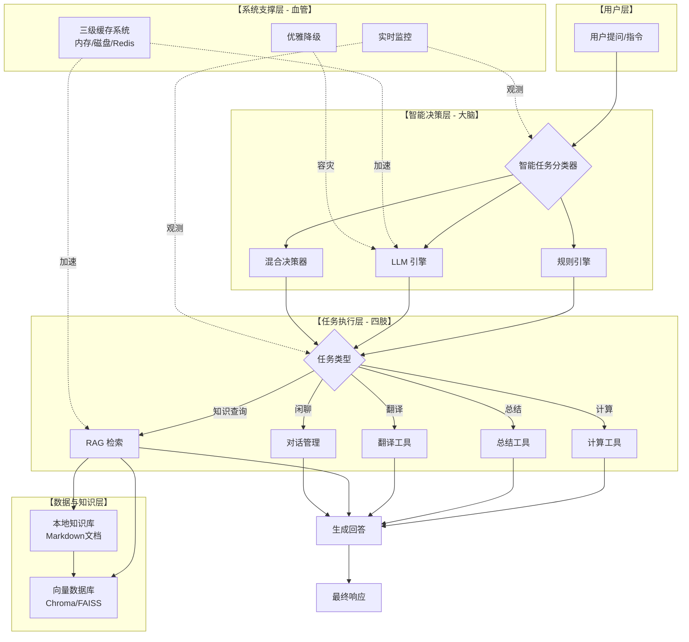

```mermaid
graph TB
    subgraph "【用户层】"
        A[ 用户提问/指令]
    end

    subgraph "【智能决策层 - 大脑】"
        B{ 智能任务分类器}
        C[ 规则引擎]
        D[ LLM 引擎]
        E[ 混合决策器]
    end

    subgraph "【任务执行层 - 四肢】"
        F{ 任务类型}
        G[ 计算工具]
        H[ 总结工具]
        I[ 翻译工具]
        J[ RAG 检索]
        K[ 对话管理]
    end

    subgraph "【数据与知识层】"
        L[ 本地知识库<br>Markdown文档]
        M[ 向量数据库<br>Chroma/FAISS]
    end

    subgraph "【系统支撑层 - 血管】"
        N[ 三级缓存系统<br>内存/磁盘/Redis]
        O[ 优雅降级]
        P[ 实时监控]
    end

    A --> B
    B --> C
    B --> D
    B --> E
    C --> F
    D --> F
    E --> F
    
    F -->|计算| G
    F -->|总结| H
    F -->|翻译| I
    F -->|知识查询| J
    F -->|闲聊| K
    
    J --> L
    J --> M
    L --> M
    
    N -.->|加速| D & J
    O -.->|容灾| D
    P -.->|观测| B & F
    
    G --> Q[ 生成回答]
    H --> Q
    I --> Q
    J --> Q
    K --> Q
    
    Q --> R[ 最终响应]
```
