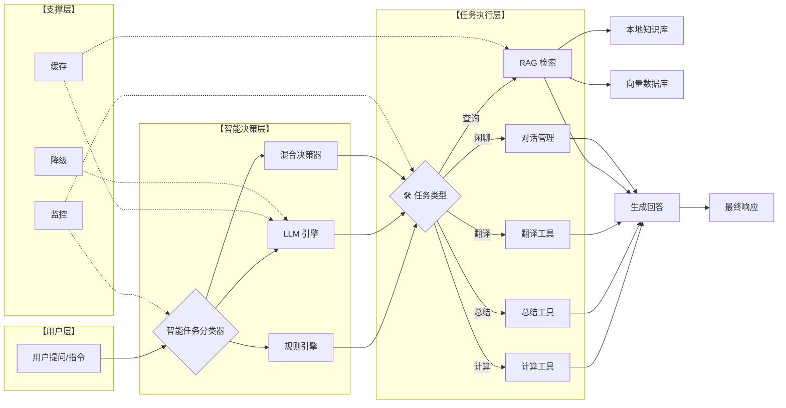

```mermaid
graph LR
    subgraph "【用户层】"
        A[ 用户提问/指令]
    end

    subgraph "【智能决策层】"
        B{ 智能任务分类器}
        C[ 规则引擎]
        D[ LLM 引擎]
        E[ 混合决策器]
    end

    A --> B
    B --> C
    B --> D
    B --> E
    
    C --> F{🛠️ 任务类型}
    D --> F
    E --> F
    
    subgraph "【任务执行层】"
        F -->|计算| G[ 计算工具]
        F -->|总结| H[ 总结工具]
        F -->|翻译| I[ 翻译工具]
        F -->|查询| J[ RAG 检索]
        F -->|闲聊| K[ 对话管理]
    end
    
    J --> L[ 本地知识库]
    J --> M[ 向量数据库]
    
    subgraph "【支撑层】"
        N[ 缓存] -.-> D
        N -.-> J
        O[ 降级] -.-> D
        P[ 监控] -.-> B & F
    end
    
    G --> Q[ 生成回答]
    H --> Q
    I --> Q
    J --> Q
    K --> Q
    
    Q --> R[ 最终响应]
```
